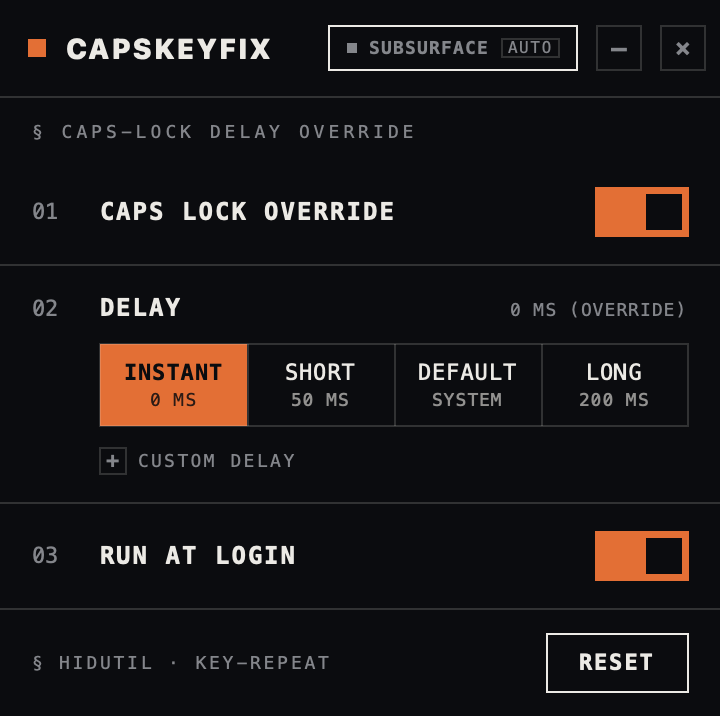
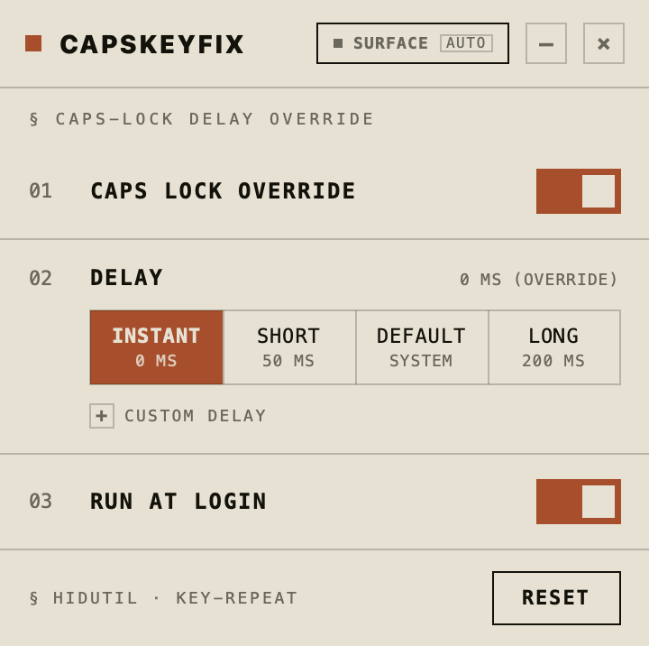
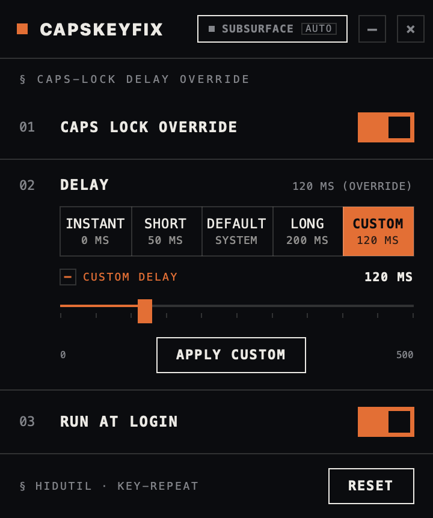
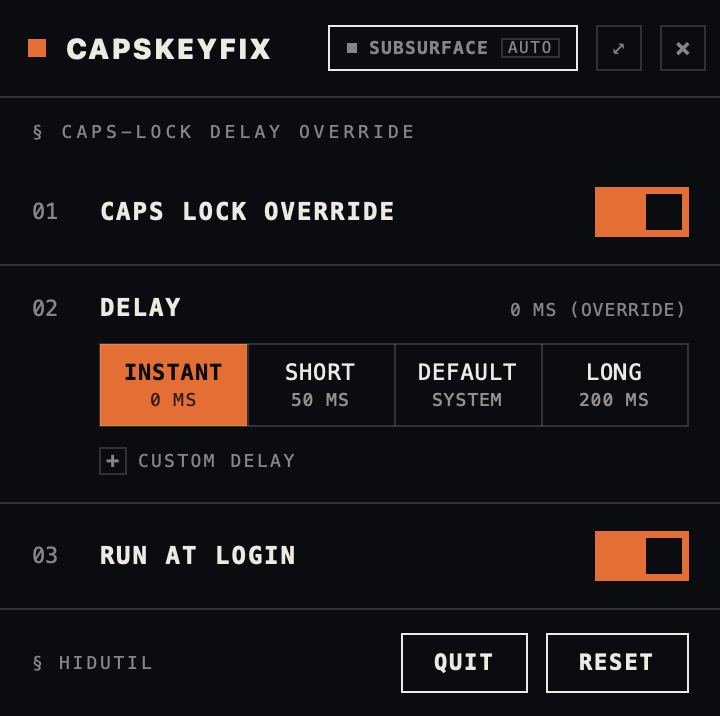

<h1 align="center">CapsKeyFix</h1>

<strong>Caps Lock, without the wait.</strong> A tiny, native macOS menu-bar utility that removes or retunes the Caps Lock delay — Instant, Short, Default, Long, or a custom value. Free, no dependencies.

Part of <a href="https://highbasalt.com">HighBasalt</a> · <a href="https://highbasalt.com/apps/capskeyfix.html">App page</a>

  

---

## Why

macOS deliberately delays Caps Lock so you don't toggle it by accident. If you actually use the key — or remapped it to Control, Escape, or a hyper key — that pause is dead weight. CapsKeyFix removes it, or retunes it to any value you like, then gets out of the way in your menu bar.

## Screenshots

<table>
  <tr>
    <td align="center" width="50%">
       
      <b>Subsurface</b> — the dark world
    </td>
    <td align="center" width="50%">
       
      <b>Surface</b> — the light world
    </td>
  </tr>
  <tr>
    <td align="center" width="50%">
       
      <b>Custom delay</b> — an opt-in 0–500 ms slider
    </td>
    <td align="center" width="50%">
       
      <b>Menu bar</b> — the same panel, dropped from the status item
    </td>
  </tr>
</table>

## Features

- **Remove the delay** — one switch and Caps Lock fires the instant you press it. No more waiting.
- **Four presets** — Instant (0 ms), Short (50 ms), Default (system), Long (200 ms).
- **Custom delay (opt-in)** — reveal a 0–500 ms slider when you want it; every tick lands with a haptic detent on a Force Touch trackpad.
- **Run at login** — reapplies your delay at login, so it survives restarts.
- **Menu-bar resident** — close the window and the app slips out of the Dock behind a Caps Lock glyph; click it and the *same* full panel drops down, and one button detaches it back into a window.
- **Reset any time** — hands the key straight back to macOS, no trace left behind.
- **Two worlds** — Surface (light) and Subsurface (dark) themes that follow your system appearance, in the HighBasalt look: flat fills, hairline seams, hard 90° corners, a single lit accent.

## Requirements

- macOS 13 Ventura or later
- Apple Silicon & Intel
- Haptic feedback needs a Force Touch trackpad; everything else works on any Mac

## Install

Download the latest build from [Releases](https://github.com/svnkrpm/CapsKeyFix/releases/latest), unzip, drag **CapsKeyFix.app** to `/Applications`, and launch it. Flip the switch and pick a delay.

> On first launch, macOS Gatekeeper may warn about an "unidentified developer." Right-click the app → **Open** → **Open** to allow it.

## Private & safe

No kernel extensions, no input monitoring, no accessibility permissions, no network access, no accounts, and no telemetry. CapsKeyFix only adjusts the system Caps Lock setting and remembers your chosen delay locally.

## License

© 2026 HighBasalt · Noah F. Khan. All rights reserved.

---

*Found a bug? [highbasalt@winzero.com](mailto:highbasalt@winzero.com)*
